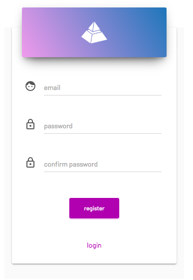
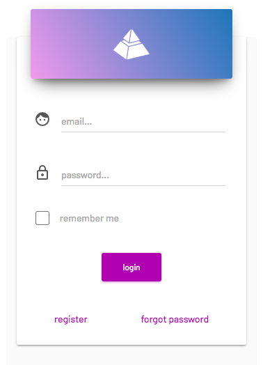
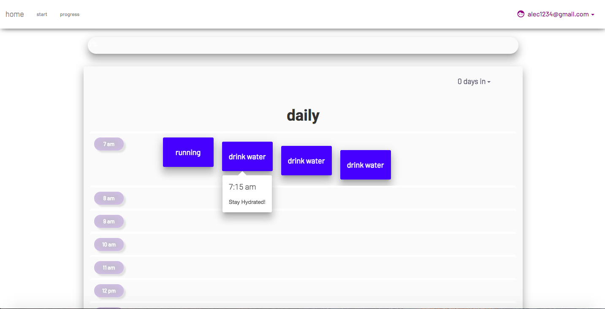
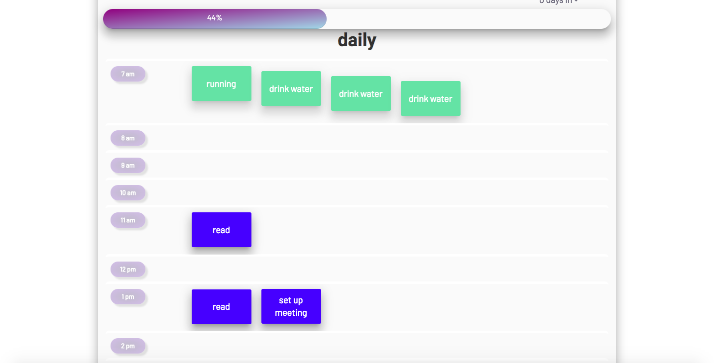

# WebbyWeb
.NET Application with Login/Register capabilities using Azure

<h4> Register account, security from Azure Cloud Database </h4>

   

<h4> Login Once Registered </h4>

  

<h4> Start Creating Some Habits! </h4>

  

<h4> Keep Track of your Daily Schedule with an interactive calendar </h4>

  

<h4> Mark a habit as completed by clicking it, watch your progress bar go up! </h4>

  

<h4> Keep track of your progress as the weeks and months go on </h4>

  
